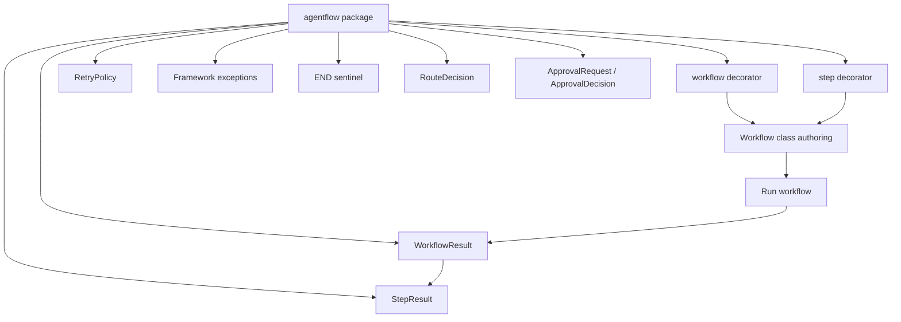

# API Architecture

## Purpose

This document explains the current public API of Agent Workflow Kit as it
exists today.

The focus here is not every internal implementation detail, but the developer
surface that users actually import from `agentflow` when they build workflows.

## Public API at a glance

The current top-level public API is intentionally small:

- `workflow`
- `step`
- `WorkflowResult`
- `StepResult`
- `RetryPolicy`
- `END`
- `ApprovalRequest`
- `ApprovalDecision`
- `RouteDecision`
- `ApprovalRequiredError`
- `AgentFlowError`
- `WorkflowDefinitionError`
- `WorkflowExecutionError`
- `StepExecutionError`
- `StateValidationError`
- `RouteResolutionError`

That API shape is enough to define workflows, run them, inspect results, and
reason about framework-specific failures.

## Public API in one diagram



## Decorator API

### `@workflow`

`@workflow` marks a class as an Agent Workflow Kit workflow.

In the current MVP, it is responsible for:

- attaching workflow metadata
- collecting step definitions prepared by `@step`
- preserving declaration order
- injecting a `run(self, state, *, raise_on_failure=False,
  approval_handler=None)` entry point unless the class already defines `run`

This decorator is the main opt-in point for the workflow authoring model.

### `@step`

`@step` marks a workflow method as an executable step.

Today it supports:

- ordered step registration
- optional custom step naming
- optional description metadata
- optional retry overrides
- optional route maps for conditional branching
- optional approval metadata for approval-gated steps

At the authoring level, this means a user can keep step logic as plain Python
methods while still giving the runtime structured metadata to execute them.

Approval options currently include:

- `requires_approval`
- `approval_message`
- `approval_metadata`

### `END`

`END` is the public terminal route sentinel.

Use it in step route maps when a branch should complete the workflow
successfully instead of moving to another step.

## Workflow authoring shape

The current public authoring style looks like this:

```python
from dataclasses import dataclass

from agentflow import step, workflow


@dataclass
class RefundState:
    order_id: str
    approved: bool = False
    decision_text: str = ""


@workflow
class RefundWorkflow:
    @step
    def validate_request(self) -> str:
        self.state.approved = True
        return "Refund request validated."

    @step
    def publish_decision(self) -> str:
        self.state.decision_text = f"Refund approved for {self.state.order_id}."
        return self.state.decision_text
```

This is the central shape of the current SDK:

- plain Python class
- typed state object
- `@workflow` on the class
- `@step` on ordered instance methods

## Runtime entry point

The main runtime entry point for users is:

```python
workflow_instance.run(state, *, raise_on_failure=False)
```

Approval-gated workflows can also pass:

```python
workflow_instance.run(state, approval_handler=handler)
```

### Parameters

- `state`
  - the initial shared workflow state object
- `raise_on_failure`
  - when `False`, the runtime returns a failed `WorkflowResult`
  - when `True`, the runtime raises `WorkflowExecutionError` after failure
- `approval_handler`
  - optional callback for approval-gated steps
  - receives `ApprovalRequest`
  - returns `ApprovalDecision` or `bool`

### Return value

On normal usage, `run(...)` returns a `WorkflowResult`.

This object is the main inspection surface for callers after a workflow run.

## Result types

### `WorkflowResult`

`WorkflowResult` represents the final workflow execution outcome.

It currently includes:

- `workflow_name`
- `state`
- `status`
- `steps`
- `error`
- `started_at`
- `finished_at`
- `duration_ms`
- `route_trace`

This gives the caller access to both the final business state and the runtime
execution story.

### `StepResult`

`StepResult` represents the outcome of one executed step.

It currently includes:

- `step_name`
- `status`
- `attempts`
- `output`
- `error`
- `started_at`
- `finished_at`
- `duration_ms`
- `route_key`
- `next_step`
- `skipped_reason`
- `approval_required`
- `approval_decision`

This is what makes the current MVP useful for debugging and inspection even
without a dashboard.

### `RouteDecision`

`RouteDecision` records one route choice made by a routed step.

It currently includes:

- `step_name`
- `route_key`
- `next_step`
- `ended`

### `ApprovalRequest`

`ApprovalRequest` is passed to an approval handler before an approval-gated
step runs.

It currently includes:

- `workflow_name`
- `step_name`
- `run_id`
- `state`
- `message`
- `metadata`

### `ApprovalDecision`

`ApprovalDecision` records the handler decision.

It currently includes:

- `approved`
- `reason`
- `metadata`

## Retry API

### `RetryPolicy`

`RetryPolicy` is the effective runtime policy used for a specific step
execution.

It currently contains:

- `retries`
- `retry_on`
- `delay`

Users do not usually build `RetryPolicy` manually during basic workflow
authoring, but it is part of the public API because it is one of the documented
runtime concepts exposed by the package.

## Exception model

The public exception hierarchy exists so callers can distinguish framework
failures from ordinary business exceptions.

### `AgentFlowError`

Base class for framework-specific errors.

### `WorkflowDefinitionError`

Raised when workflow or step definitions violate SDK rules.

Examples include:

- invalid step signatures
- duplicate step names
- reserved naming conflicts

### `WorkflowExecutionError`

Raised when a workflow fails and the caller requested
`raise_on_failure=True`.

### `StateValidationError`

Raised when the initial workflow state is invalid for execution.

### `RouteResolutionError`

Raised when a routed step returns an invalid route key, such as an unknown key
or a non-string value.

### `ApprovalRequiredError`

Raised when an approval-gated step cannot obtain approval.

Common causes include:

- missing approval handler
- denied approval
- invalid approval handler return value

### `StepExecutionError`

This type is part of the public hierarchy, but the current MVP does not yet use
it as the main wrapper for business exceptions. Today, the original underlying
exception is preserved directly on `StepResult.error` and `WorkflowResult.error`
instead.

## Status model

The result objects use explicit status enums.

Today the workflow and step layers both recognize statuses such as:

- `pending`
- `running`
- `succeeded`
- `failed`
- `skipped`

In the current linear MVP, `succeeded` and `failed` are the most important
states in real usage, while `skipped` exists for API completeness and future
evolution.

## What the public API does not expose yet

The current API does not yet expose higher-level workflow features such as:

- async workflow APIs
- persistence handles
- persistent approval pause/resume
- visualization APIs
- external orchestration adapters

That is intentional. The current public API is trying to stay small, teachable,
and aligned with the runtime that already exists.

## Best way to think about the API today

The current API is a compact workflow authoring and inspection surface:

- decorators define the workflow
- `run(...)` executes it
- result objects explain what happened
- framework exceptions distinguish SDK failures from business failures

That small surface area is one of the strongest parts of the current MVP.
