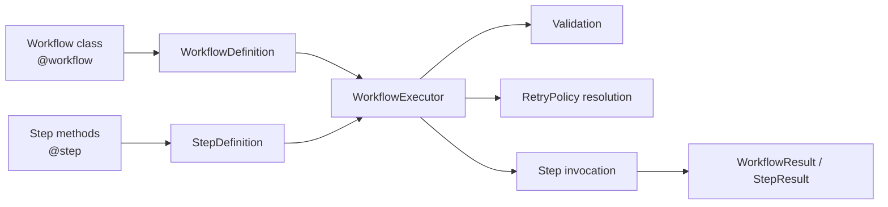
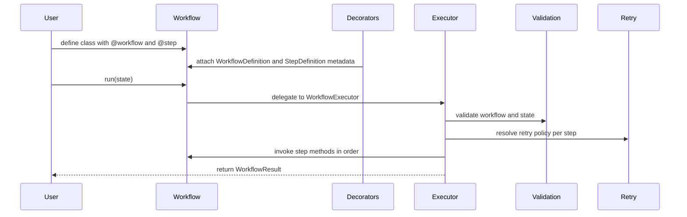

# Architecture Overview

## Purpose

Agent Workflow Kit is currently a small workflow runtime for building linear
agent workflows with plain Python.

At a high level, the implemented system has five main parts:

- decorators
- models
- validation
- executor/runtime
- retry helpers

## Current architecture in one diagram

## Main building blocks

### 1. Decorators

The authoring layer lives in `agentflow.decorators`.

Its job is to:

- mark step methods with `@step`
- mark workflow classes with `@workflow`
- collect step metadata in declaration order
- attach workflow metadata to the class
- inject a `run(...)` method if the class does not already define one

The decorators are intentionally lightweight. They prepare metadata and defer
real execution behavior to the runtime layer.

### 2. Models

The shared data contracts live in `agentflow.models`.

These models describe:

- workflow metadata
- step metadata
- runtime context
- step results
- workflow results
- status enums

This layer gives the rest of the SDK a stable internal vocabulary.

### 3. Validation

Validation lives in `agentflow.validation`.

Its job is to reject invalid workflow setups before or during execution, such
as:

- empty workflows
- duplicate step names
- invalid retry configuration
- unsupported step signatures
- reserved names like `run`

Validation is kept separate from decorators so definition-time metadata and
runtime checks do not become tightly coupled.

### 4. Executor and runtime helpers

The execution layer lives mainly in:

- `agentflow.executor`
- `agentflow.runtime`

The executor is responsible for:

- reading workflow metadata
- validating the workflow and input state
- assigning shared state to `self.state`
- running steps in order
- applying retry behavior
- collecting structured results
- optionally raising `WorkflowExecutionError`

The runtime module stays intentionally small and delegates to the executor.

### 5. Retry layer

Retry behavior lives in `agentflow.retry`.

Its job is to:

- resolve step-level and workflow-level retry settings
- decide whether an error should be retried
- apply fixed retry delay

This keeps retry policy logic out of the main executor flow.

## Execution flow in one picture

## Architectural character of the current SDK

The current architecture is intentionally:

- synchronous
- linear
- stateful
- explicit
- small enough to inspect without framework magic

This is why the project is currently well-suited for workflows like:

- refund decisions
- support triage
- content review
- internal linear automation flows

## Current limits

The implemented architecture does not yet include:

- branching
- async execution
- persistence
- human approval steps
- distributed execution

Those should be treated as future extensions, not current architecture.
