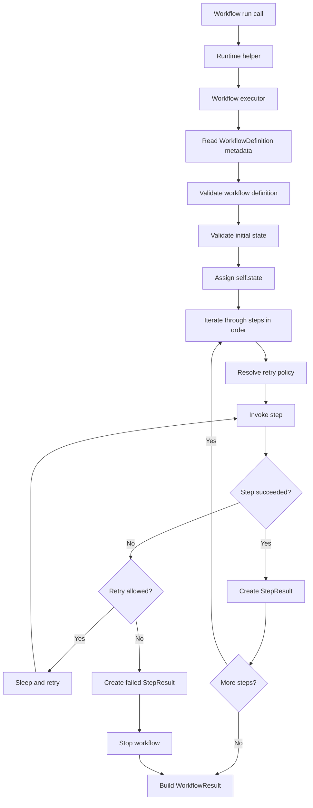
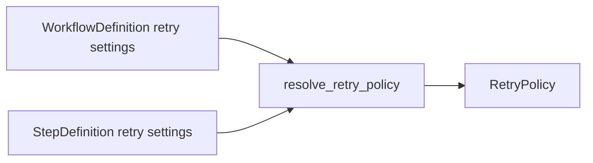

# Runtime Flow

## Purpose

This document explains how the current runtime executes a workflow from
`workflow_instance.run(state)` to a final `WorkflowResult`.

## Runtime flow



## Step-by-step explanation

### 1. The public `run(...)` entry point

The workflow class gets a `run(self, state, *, raise_on_failure=False)` method
from the `@workflow` decorator unless the class already defines its own `run`.

That method delegates into `agentflow.runtime.run_workflow(...)`.

### 2. The executor takes control

`run_workflow(...)` creates a `WorkflowExecutor` and hands execution off to it.

From that point on, the executor is responsible for the full workflow run.

### 3. Workflow metadata is loaded

The executor reads the metadata attached by the decorators:

- `WorkflowDefinition`
- collected `StepDefinition` objects

If workflow metadata is missing, execution fails with
`WorkflowDefinitionError`.

### 4. Validation happens before step execution

Before any step runs, the executor validates:

- the workflow definition
- the initial state
- each step signature before invocation

This keeps authoring mistakes from surfacing as confusing runtime behavior.

### 5. Shared state is assigned

The executor assigns the provided state object to:

- `workflow_instance.state`

That means step methods read and mutate shared state directly through
`self.state`.

The current runtime does not copy or serialize the state object.

### 6. Steps run in declaration order

The executor walks through the collected step definitions in the order the step
methods were declared on the class.

For each step, it:

- resolves the bound method
- validates the unbound method signature
- builds a `RunContext`
- resolves the effective `RetryPolicy`
- invokes the step

## Retry behavior

Retry behavior is currently step-local and synchronous.

The runtime supports:

- workflow-level retry defaults
- step-level retry overrides
- fixed retry delay
- retry decisions based on exception type

### Retry resolution



If a step leaves retry values as `None`, the workflow defaults are used.

If a step provides explicit retry values, those override the workflow defaults.

### Retry loop behavior

For each step attempt:

1. run the step
2. if it succeeds, record a successful `StepResult`
3. if it fails, ask `should_retry(...)`
4. if retry is allowed, sleep and try again
5. if retry is not allowed, record a failed `StepResult` and stop the workflow

## Result objects

The runtime produces two result layers:

- `StepResult`
- `WorkflowResult`

### `StepResult`

Each executed step records:

- step name
- status
- number of attempts
- output
- error
- timestamps
- duration

### `WorkflowResult`

The workflow result records:

- workflow name
- final status
- final shared state
- the executed step results
- the final error, if any
- workflow-level timestamps
- total duration

## Failure behavior

The current runtime is fail-fast.

That means:

- execution stops at the first permanently failing step
- later steps are not run
- the workflow result is marked failed

If `raise_on_failure=False`:

- the runtime returns a failed `WorkflowResult`

If `raise_on_failure=True`:

- the runtime raises `WorkflowExecutionError`
- the original underlying exception is preserved as the cause

## Supported step signatures

The runtime currently supports step methods shaped like:

```python
def step(self): ...
def step(self, context): ...
```

Async step methods and more complex signatures are intentionally out of scope
for the current MVP.

## What the current runtime does not do

The runtime currently does not support:

- branching
- skipped-step synthesis
- async execution
- workflow persistence
- distributed workers
- observability pipelines

That keeps the runtime small, explicit, and easy to reason about.
