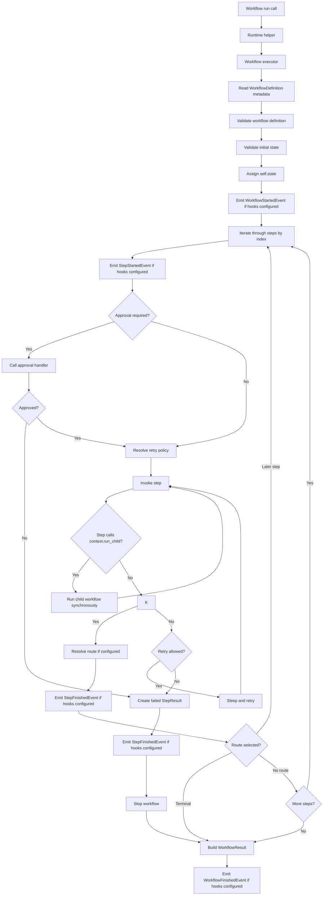
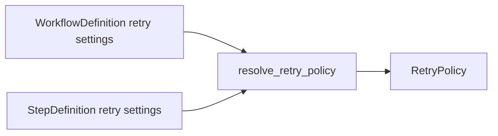

# Runtime Flow

## Purpose

This document explains how the current runtime executes a workflow from
`workflow_instance.run(state)` to a final `WorkflowResult`.

## Runtime flow

Graph export is separate from runtime execution. `export_workflow_graph(...)`
reads and validates workflow metadata, but it does not enter the execution flow
below or inspect dynamic child workflow calls.



## Step-by-step explanation

### Runtime-adjacent graph export

Before running a workflow, users can call `export_workflow_graph(...)` with a
workflow class or instance.

That path reads the same `WorkflowDefinition` and `StepDefinition` metadata used
by the executor, validates the workflow definition, and returns a
`WorkflowGraph`. It does not assign state, request approval, invoke steps, or
resolve runtime route outputs.

### 1. The public `run(...)` entry point

The workflow class gets a `run(self, state, *, raise_on_failure=False,
approval_handler=None, hooks=None)` method
from the `@workflow` decorator unless the class already defines its own `run`.

That method delegates into `agentflow.runtime.run_workflow(...)`.

### 2. The executor takes control

`run_workflow(...)` creates a `WorkflowExecutor` and hands execution off to it.

From that point on, the executor is responsible for the full workflow run.

### 3. Workflow metadata is loaded

The executor reads the metadata attached by the decorators:

- `WorkflowDefinition`
- collected `StepDefinition` objects

If workflow metadata is missing, execution fails with
`WorkflowDefinitionError`.

### 4. Validation happens before step execution

Before any step runs, the executor validates:

- the workflow definition
- the initial state
- each step signature before invocation

This keeps authoring mistakes from surfacing as confusing runtime behavior.

### 5. Shared state is assigned

The executor assigns the provided state object to:

- `workflow_instance.state`

That means step methods read and mutate shared state directly through
`self.state`.

The current runtime does not copy or serialize the state object.

### 6. Steps run in declaration order unless routed

The executor walks through the collected step definitions in the order the step
methods were declared on the class unless a routed step chooses a later step.

For each step, it:

- resolves the bound method
- validates the unbound method signature
- builds a `RunContext`
- emits step lifecycle events when hooks are configured
- requests approval when the step requires it
- resolves the effective `RetryPolicy`
- invokes the step
- records child workflow results when the step calls `context.run_child(...)`
- resolves any declared route decision

## Workflow composition behavior

Context-aware steps can call `context.run_child(...)` to run another workflow
synchronously inside the current parent step.

The child workflow uses normal runtime behavior:

- validation
- shared state assignment
- retries
- approval handlers
- hooks
- routing
- structured `WorkflowResult`

Child workflow results are attached to the parent step in
`StepResult.child_workflows`.

By default, a failed child workflow stops the parent step with
`ChildWorkflowExecutionError`. A parent step can pass
`fail_parent_on_failure=False` when it wants to inspect a failed child result
and continue.

Child workflows inherit the parent approval handler and hooks unless the caller
passes replacements to `context.run_child(...)`.

Composition does not persist child workflows, schedule background work, run
children in parallel, or make graph export show dynamic child calls.

## Hook behavior

Lifecycle hooks are optional synchronous callbacks passed through `run(...)`.

When configured, the runtime emits:

- `WorkflowStartedEvent`
- `StepStartedEvent`
- `StepFinishedEvent`
- `WorkflowFinishedEvent`

Hooks are called in the order provided. Their return values are ignored.

If a hook raises an exception, the workflow fails with `HookExecutionError`.
With `raise_on_failure=True`, that failure is wrapped in
`WorkflowExecutionError`.

Hooks are not retried and are not an async event bus or tracing backend.

## Branching behavior

Branching is opt-in per step through `@step(routes=...)`.

For a routed step:

1. the step returns a string route key
2. the runtime looks up that key in the step route map
3. the route target is either a later public step name or `END`
4. the workflow jumps forward, or ends successfully

Route decisions are recorded in `WorkflowResult.route_trace`.

Declared but unvisited steps in branching workflows are represented by skipped
`StepResult` entries with `attempts=0` and a `skipped_reason`.

## Approval behavior

Approval is opt-in per step through `@step(requires_approval=True, ...)`.

For an approval-gated step:

1. the executor builds an `ApprovalRequest`
2. the user-provided `approval_handler` returns `ApprovalDecision` or `bool`
3. approved decisions allow the step method to run
4. denied, missing, or invalid approvals fail the workflow before step invocation

Approval decisions are recorded on `StepResult.approval_decision`.

Approval happens before retry handling. The approval handler is not retried in
the current runtime, but the approved step method still uses normal retry
behavior.

## Retry behavior

Retry behavior is currently step-local and synchronous.

The runtime supports:

- workflow-level retry defaults
- step-level retry overrides
- fixed retry delay
- retry decisions based on exception type

### Retry resolution



If a step leaves retry values as `None`, the workflow defaults are used.

If a step provides explicit retry values, those override the workflow defaults.

### Retry loop behavior

For each step attempt:

1. run the step
2. if it succeeds, record a successful `StepResult`
3. if it fails, ask `should_retry(...)`
4. if retry is allowed, sleep and try again
5. if retry is not allowed, record a failed `StepResult` and stop the workflow

## Result objects

The runtime produces two result layers:

- `StepResult`
- `WorkflowResult`

### `StepResult`

Each executed step records:

- step name
- status
- number of attempts
- output
- error
- timestamps
- duration
- route key and next step when routing is used
- skipped reason for synthesized skipped results
- approval requirement and approval decision when approval is used
- child workflow results when composition is used

### `WorkflowResult`

The workflow result records:

- workflow name
- final status
- final shared state
- the executed step results
- the final error, if any
- workflow-level timestamps
- total duration
- route trace

## Failure behavior

The current runtime is fail-fast.

That means:

- execution stops at the first permanently failing step
- later steps are not run
- the workflow result is marked failed

If `raise_on_failure=False`:

- the runtime returns a failed `WorkflowResult`

If `raise_on_failure=True`:

- the runtime raises `WorkflowExecutionError`
- the original underlying exception is preserved as the cause

## Supported step signatures

The runtime currently supports step methods shaped like:

```python
def step(self): ...
def step(self, context): ...
```

Async step methods and more complex signatures are intentionally out of scope
for the current MVP.

## What the current runtime does not do

The runtime currently does not support:

- async execution
- workflow persistence
- persistent approval pause/resume
- distributed workers
- async event buses or external tracing backends
- graph execution
- dashboards or interactive visual editors

That keeps the runtime small, explicit, and easy to reason about.
