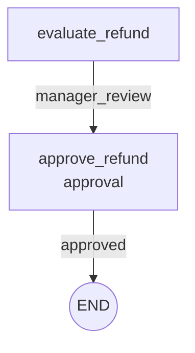

# Workflow Graphs

## Purpose

Workflow graph export lets you inspect a workflow's declared structure before
running it.

The graph is built from `@workflow` and `@step` metadata. Exporting a graph does
not execute steps, mutate state, request approval, or resolve runtime route
outputs.

## Basic graph export

Use `export_workflow_graph(...)` with a workflow class or workflow instance.

```python
from agentflow import export_workflow_graph

graph = export_workflow_graph(RefundWorkflow)

print(graph.workflow_name)
print(graph.nodes)
print(graph.edges)
```

The returned `WorkflowGraph` contains:

- `workflow_name`
- `nodes`
- `edges`

Each node records its stable graph id, public step label, node kind, approval
flag, and optional description.

Each edge records its source, target, kind, and optional route key.

## Mermaid rendering

Use `to_mermaid()` when you want a diagram-friendly text format.

```python
graph = export_workflow_graph(RefundWorkflow)
print(graph.to_mermaid())
```

Example output:



You can paste the Mermaid output into Markdown tools that support Mermaid
diagrams.

## What appears in the graph

Linear workflows produce unlabeled linear edges between declared steps.

Routed steps produce labeled route edges from route keys:

```python
@step(routes={"approved": "approve_refund", "denied": "deny_refund"})
def evaluate_refund(self) -> str:
    return "approved"
```

Routes to `END` produce a terminal `END` node.

Approval-gated steps are marked in the graph and rendered with an `approval`
label in Mermaid output.

## Validation

Graph export reuses normal workflow validation.

That means invalid route targets, backward routes, duplicate step names, and
other workflow definition errors are rejected before a graph is returned.

## What graph export does not do

Graph export is intentionally not a graph execution engine.

It does not provide:

- runtime execution
- route simulation
- approval handling
- dashboards
- interactive visual editing
- persistence or resume behavior

It is a lightweight inspection and documentation tool for the workflow metadata
that already exists.

## See also

For a runnable example, see:

- [../../examples/graph_export.py](../../examples/graph_export.py)
